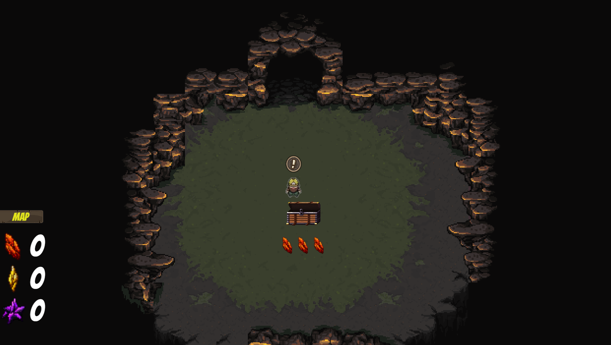

## Cave Explorer
- You play as a miner who is seeking to become rich so he explores caves looking to find expensive minerals to sell. These caves are long and easy to get lost in, but fortunately for the miner he figured out they are all structured as binary trees! He utilizes Bread-First Search (BFS) and Depth-First Search to safely navigate his way through the binary tree caves. The further in depth he goes into the cave the more expensive gems he will find along the way. Help the miner become rich while also learning how to traverse binary trees!
## Developers
- Dylan Giletto (dgiletto@udel.edu)
- Oryem Kilama (okoryem@udel.edu)
- Priya Salako (psalako@udel.edu)
- Nathan Wood (nathwood@udel.edu)
## Basic Instructions
- Basic Movement (W,A,S,D)
- Interact (E)
- Map (Left-Click Map Button)
## Screenshot

## Gameplay Video
- [Gameplay Video](https://drive.google.com/file/d/1Y0vQZBFz0zsWkTdtBx_8S4KPe9D2NHl7/view?usp=sharing) 
## Educational Game Design Document
- [Educational Game Design Document](Docs/EGDD.md)
## Resources
- Miner Character
  - Author: KostK2Boss
  - [Miner Sprite Sheet](https://www.deviantart.com/kostk2boss/art/custom-miner-sprites-252465211)
- Cave Tile Map
  - Author: Szadi Art
  - [RPG World Caves](https://assetstore.unity.com/packages/2d/environments/rpg-worlds-caves-167274)
- Jewel Pixel Art
  - Author: CraftPix
  - [Free Minerals Pixel Art Icons](https://assetstore.unity.com/packages/2d/gui/icons/free-minerals-pixel-art-icons-196216)
- Chest Pixel Art
  - Author: Karsiori
  - [Pixel Chests Pack - Animated](https://assetstore.unity.com/packages/2d/environments/pixel-chests-pack-animated-263923)
- UI
  - Author: Black Hammer
  - [Fantasy Wooden GUI: Free](https://assetstore.unity.com/packages/2d/gui/fantasy-wooden-gui-free-103811)
- Sound Effects
  - Chest Open SFX
    - Author: Floraphonic
    - [Wooden Trunk Latch 1](https://pixabay.com/sound-effects/wooden-trunk-latch-1-183944/)
  - Ding SFX
    - Author: LanooskiProductions (FreeSound)
    - [Ding](https://pixabay.com/sound-effects/ding-101377/)
  - Footsteps SFX
    - Author: mypantsfelldown (Freesound)
    - [Concrete Footsteps](https://pixabay.com/sound-effects/concrete-footsteps-6752/)
  - Background Music
    - Author: GameChops
    - [Stardew Ambient](https://www.youtube.com/watch?v=UVWj55mVnrc)
## Links
- [Presentation](https://www.canva.com/design/DAGnnlecW_k/Gqe0kBusqaLeEzOMlDkHTA/edit)
- [Game](https://okoryem.github.io/Tree-Explorer/)
